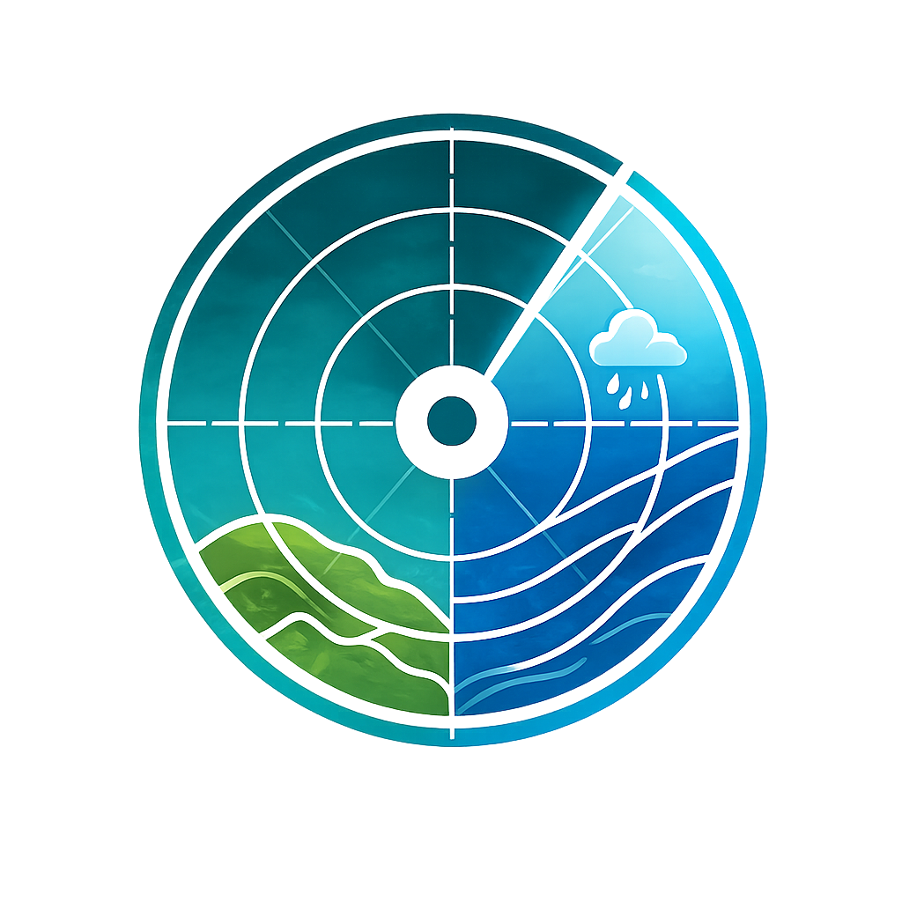
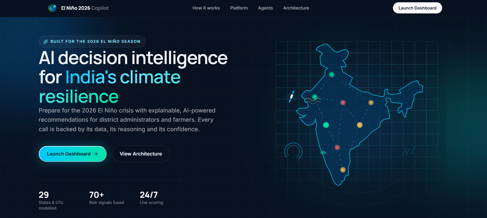
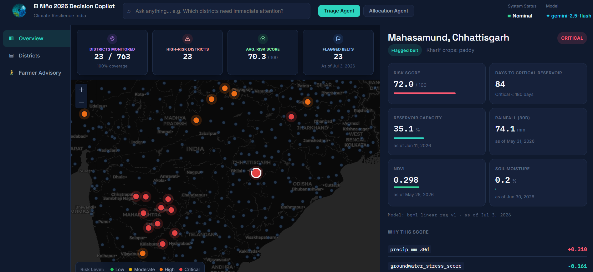

<p align="center">
  
</p>

# El Niño 2026 Decision Copilot — Climate Resilience India

**AI-powered decision intelligence platform for India's El Niño 2026 monsoon/drought crisis, targeting district administrators and farmers.**

Built on Google Cloud for the Gen AI Academy APAC Hackathon.

## 🔴 Live Demo

### 👉 **[https://climate-resilience-in.web.app](https://climate-resilience-in.web.app)** 👈

[](https://climate-resilience-api-731583000008.asia-south1.run.app)
[](https://climate-resilience-in.web.app)
[](https://cloud.google.com/vertex-ai)

### 🎥 Demo Video

<p align="center">
  <a href="https://youtu.be/U0Voa4h71II">
    
  </a>
</p>

<p align="center">
  <a href="https://youtu.be/U0Voa4h71II"><strong>▶ Watch on YouTube</strong></a>
</p>

---

---

## 📌 Project Overview

This platform provides actionable, data-driven insights to mitigate the impact of the escalating 2026 El Niño "super El Niño" on Indian agriculture and water resources. It serves two distinct audiences through one intelligent core:

1. **Administrator Console**: Equips district collectors and disaster management officers with a risk map, predictive insights (reservoir depletion, crop stress), and an AI assistant for optimal resource allocation (e.g., water tankers, relief budget).
2. **Citizen/Farmer Advisory**: Provides a mobile-first interface for farmers to receive localized crop sowing and switching advice, backed by official contingency plans and real-time weather forecasts.

The system is built on a **Decision Intelligence Core**: Ingestion → Risk Model → Reasoning Agent → Explanation Layer.

---

## 🔄 Process Flow

Ingestion → Risk Model → Reasoning Agents → Explanation Layer, ending in an auditable decision for district officers and a localized, cited recommendation for farmers.

<p align="center">
  
</p>

---

## 🏗️ Architecture

<p align="center">
  
</p>


The solution leverages Google Cloud services for a robust, scalable architecture:

- **Data Ingestion**: Python scripts pulling from Tier 1 APIs (Google Earth Engine, OpenWeatherMap, Agmarknet, MGNREGA/data.gov.in) and static/regional-fallback Tier 2 data (CWC, CGWB, NRSC).
- **Data Warehouse**: **Google BigQuery** serving as the central source of truth (`district_master`, `rainfall_daily`, `reservoir_status`, `mandi_prices`, `ndvi_soil_moisture`, `weather_forecast`, `mgnrega_employment`).
- **Prediction Layer**: BigQuery ML (linear regression) calculating a baseline `district_risk_score`, currently scaling from the 23 seed districts across the flagged El Niño belt to full-India coverage (763 districts).
- **RAG / Knowledge Layer**: **Vertex AI Search** indexing real ICAR-CRIDA District Agriculture Contingency Plans — 354/763 districts indexed via an automated scraper (up from a 23-district hand-matched set), with a Gemini+grounding fallback for the remainder.
- **Agent Layer**: Three specialized agents built with the **Agent Development Kit (ADK)** and powered by **Gemini 2.5 Flash** on Vertex AI:
  - `Triage Agent`: Ranks districts by risk and explains the underlying drivers.
  - `Allocation Agent`: Deterministically allocates resources based on risk and current supply.
  - `Farmer Advisory Agent`: RAG-powered agent providing localized, actionable crop advice.
- **Application Layer**:
  - **Backend**: FastAPI (Python) deployed on **Cloud Run**.
  - **Frontend**: React + Vite (JS) SPA deployed on **Firebase Hosting**.

---

## 🚀 Features

- **Explainable AI**: Every recommendation, score, and advisory includes a *why*. Explanations are driven by transparent data points, with citations to underlying data or source documents.
- **Real-Time & Projected Insights**: Combines recent satellite data (NDVI, soil moisture), real-time weather forecasts, and historical analog years for context.
- **Interactive District Map**: Custom Leaflet map with colored risk markers and deep-dive capabilities into individual district metrics.
- **Conversational Agents**: Natural language interfaces tailored for administrative decision-making and farmer support.

---

## 🖼️ Screenshots

<p align="center">
  <br>
  <em>Landing page</em>
</p>

<p align="center">
  <br>
  <em>Admin console — district risk map and drill-down</em>
</p>

---

## 🛠️ Project Structure

- `/agents`: ADK definitions, tools, and prompts for the Triage, Allocation, and Farmer Advisory agents.
- `/backend`: FastAPI application handling API requests, BigQuery interactions, and ADK agent routing.
- `/data-collection`: Data ingestion scripts, ML model definitions (`build_risk_model.py`), and seeded static data.
- `/frontend`: React application containing the Admin Console and Farmer Chat interfaces.

---

## 💻 Tech Stack

- **Cloud & Data**: Google Cloud (BigQuery, Vertex AI, Cloud Storage, Cloud Run)
- **AI/ML**: Gemini 2.5 Flash, Vertex AI Search (RAG), BigQuery ML
- **Backend**: Python, FastAPI, Agent Development Kit (ADK)
- **Frontend**: React, Vite, React Router, React Leaflet, Firebase Hosting
- **Data Sources**: Google Earth Engine, OpenWeatherMap, Agmarknet, CWC, CGWB, NRSC, ICAR-CRIDA

---

## 🚦 Current Status & Roadmap

**Completed (as of 2026-07-04):**
- ✅ End-to-end data pipeline, originally proven on 23 high-risk districts, now scaling to full-India coverage.
- ✅ `district_master` expanded 23 → **763 districts** (LGD directory, geocoded lat/lon).
- ✅ Tier 1 ingestion (weather, forecast, NDVI/soil moisture) widened to **763/763 districts**; mandi prices and rainfall cross-check still backfilling due to data.gov.in rate limits.
- ✅ Tier 2 reservoir status widened via CWC regional-fallback aggregates to **538/763 districts**.
- ✅ RAG corpus scaled via an ICAR-CRIDA index scraper to **354/763 districts** (from 23, hand-matched).
- ✅ MGNREGA employment data ingestion in progress, feeding a new work-demand-anomaly risk label.
- ✅ Baseline BigQuery ML risk model (23-district calibrated composite index; full retrain pending the wider feature set).
- ✅ Full agent layer (Triage, Allocation, Farmer Advisory) implemented and verified end-to-end.
- ✅ Deployed API on Cloud Run and Frontend on Firebase, with CORS tightened to the real Hosting origin.

**Next Steps / Roadmap:**
1. **Finish full-India scale-up**: complete Tier 1/Tier 2 backfills, retrain the risk model on the wider feature set + MGNREGA-based label.
2. **Expand RAG Corpus**: add national-level MGNREGA drought-works guidelines alongside the district contingency plans.
3. **Security**: implement strict IAM separation between Admin and Farmer endpoints (auth mechanism still to be decided).
4. **Automation**: migrate manual data pull scripts to Cloud Functions and Cloud Scheduler.
5. **Localization**: implement Google Cloud Translation for regional languages (Hindi, Marathi, Kannada).

---

## 📄 License

This project is licensed under the MIT License - see below for details.

```text
MIT License

Copyright (c) 2026 Syed Naazim Hussain

Permission is hereby granted, free of charge, to any person obtaining a copy
of this software and associated documentation files (the "Software"), to deal
in the Software without restriction, including without limitation the rights
to use, copy, modify, merge, publish, distribute, sublicense, and/or sell
copies of the Software, and to permit persons to whom the Software is
furnished to do so, subject to the following conditions:

The above copyright notice and this permission notice shall be included in all
copies or substantial portions of the Software.

THE SOFTWARE IS PROVIDED "AS IS", WITHOUT WARRANTY OF ANY KIND, EXPRESS OR
IMPLIED, INCLUDING BUT NOT LIMITED TO THE WARRANTIES OF MERCHANTABILITY,
FITNESS FOR A PARTICULAR PURPOSE AND NONINFRINGEMENT. IN NO EVENT SHALL THE
AUTHORS OR COPYRIGHT HOLDERS BE LIABLE FOR ANY CLAIM, DAMAGES OR OTHER
LIABILITY, WHETHER IN AN ACTION OF CONTRACT, TORT OR OTHERWISE, ARISING FROM,
OUT OF OR IN CONNECTION WITH THE SOFTWARE OR THE USE OR OTHER DEALINGS IN THE
SOFTWARE.
```
